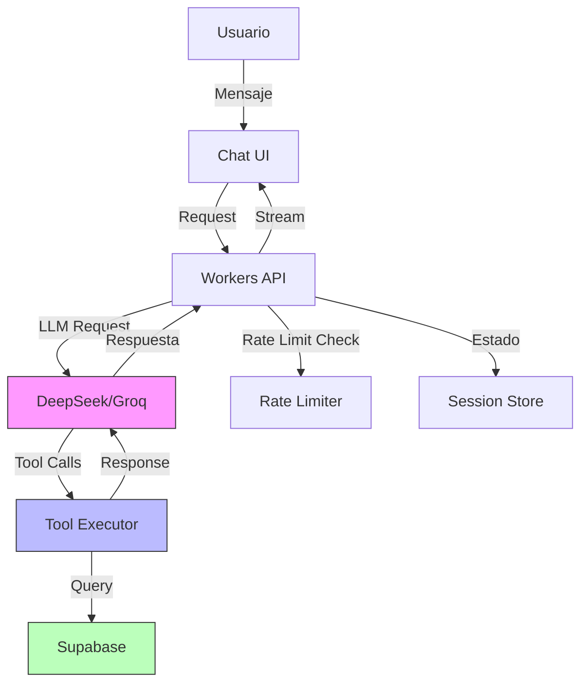

# FUTURE.md

## Roadmap Técnico - Framerate.cl

### Estado Actual
Sistema de comparación de precios con arquitectura modular: scraping batch (Docker/Puppeteer), API REST (Cloudflare Workers/Hono), frontend SSR (React Router v7), base de datos única (Supabase PostgreSQL).

---

## Planes Futuros

### Asistente de Cotización con IA (Feature Premium)

**Stack Propuesto:** LLM API (DeepSeek/Groq) + Function Calling + Gestión de Estado Conversacional

**Arquitectura:**

**Implementación Core:**

- **Function Calling nativo**: Set de herramientas expuestas al LLM (`search_products`, `add_to_quote`, `check_compatibility`, `calculate_total`, `get_best_deals`)
- **Conversaciones multi-turno**: Historial de conversación almacenado en BD con manejo de context window
- **Cotizaciones con estado**: Tabla `ai_quotes` con JSONB para items, historial y metadata de sesión
- **Capa de ejecución de herramientas**: Orquestador que mapea function calls del LLM a queries reales contra la API interna
- **Motor de compatibilidad**: Sistema de validación de specs (socket CPU/mobo, clearance RAM/cooler, TDP/PSU, etc.)

**Capacidades Técnicas:**

- Parsing de intención del usuario (presupuesto, caso de uso, preferencias de marca)
- Construcción dinámica de queries con filtros multi-dimensionales
- Algoritmo de balanceo de presupuesto por categoría (GPU 35-40%, CPU 20-25%, etc.)
- Fallback automático a alternativas si stock no disponible
- Seguimiento diferencial de precios para alertar cambios durante la conversación
- Streaming de respuestas (SSE) para UX responsiva

**Diferenciación Premium:**

Límites por tier:
- Free: 3 cotizaciones/mes, 20 mensajes/cotización, máx 10 productos
- Premium: Cotizaciones ilimitadas, mensajes ilimitados, hasta 50 productos, features adicionales (entrada de voz, guardar/exportar cotizaciones, alertas de precio)

**Monetización:**
- Medición basada en tokens para llamadas a LLM
- Feature flags por nivel de suscripción
- Analytics de uso para optimizar costos de API

---

### Otras Características Técnicas en Evaluación

#### Sistema de Alertas Reactivas
WebSocket/SSE para notificaciones real-time cuando productos observados alcancen umbrales. Cron jobs que comparan `price_history` contra reglas definidas por usuario.

#### Almacenamiento Persistente de Cotizaciones
Schema relacional (`ai_quotes`, `ai_quote_items`) con versionado. Export a PDF/JSON. Compartir via slugs únicos con TTL configurable.

#### Validación Avanzada de Compatibilidad
Motor de reglas basado en specs normalizadas: matching de sockets, cálculos de clearance de RAM, requerimientos de wattage de PSU, restricciones de form factor de gabinete. Extensible via archivos de configuración.

#### Herramienta de Comparación de Builds
Diff lado a lado de múltiples configuraciones con scoring algorítmico (FPS estimado, relación valor/precio, eficiencia energética). Data de benchmarks integrada desde fuentes públicas.

#### Optimización de Scraping
- Migración a colas distribuidas (BullMQ + Redis) para escalado horizontal
- Fingerprinting avanzado para matching de productos (más allá de MPN)
- Detección automática de productos descontinuados
- Patrón circuit breaker para tiendas con fallos recurrentes

---

## Consideraciones de Implementación

### Dependencias Técnicas Nuevas
- Proveedor de LLM API (DeepSeek, Groq, o similar con function calling)
- Session store para estado conversacional (Redis/Upstash recomendado)
- Infraestructura de streaming (SSE o WebSockets)
- Sistema de autenticación para tiers premium (Supabase Auth ya disponible)

### Desafíos Técnicos
- **Manejo de context window**: Truncar historial antiguo manteniendo contexto relevante
- **Optimización de costos**: Cache de respuestas LLM por intenciones similares
- **Confiabilidad de herramientas**: Manejo de timeouts y degradación graceful si herramientas fallan
- **Validación de compatibilidad**: Mantener reglas actualizadas con nuevos lanzamientos de hardware

### Decisiones de Arquitectura Pendientes
- ¿Function calling nativo vs capa bridge MCP?
- ¿Respuestas streaming o completions batch?
- ¿Manejo de estado client-side (React context) o sesiones server-side?
- ¿Qué modelo LLM balancea mejor costo/calidad para este caso de uso?

---

## Notas de Desarrollo

Este roadmap es iterativo. Las features se implementarán basadas en:
1. Validación técnica de viabilidad
2. Feedback de usuarios beta
3. Análisis de costos de operación (especialmente llamadas a LLM API)
4. Priorización por impacto vs esfuerzo

Cada feature nueva debe mantener los principios arquitectónicos del proyecto: separación de responsabilidades, seguridad por capas, y despliegue edge-first.

---

*Última actualización: Diciembre 2025*
