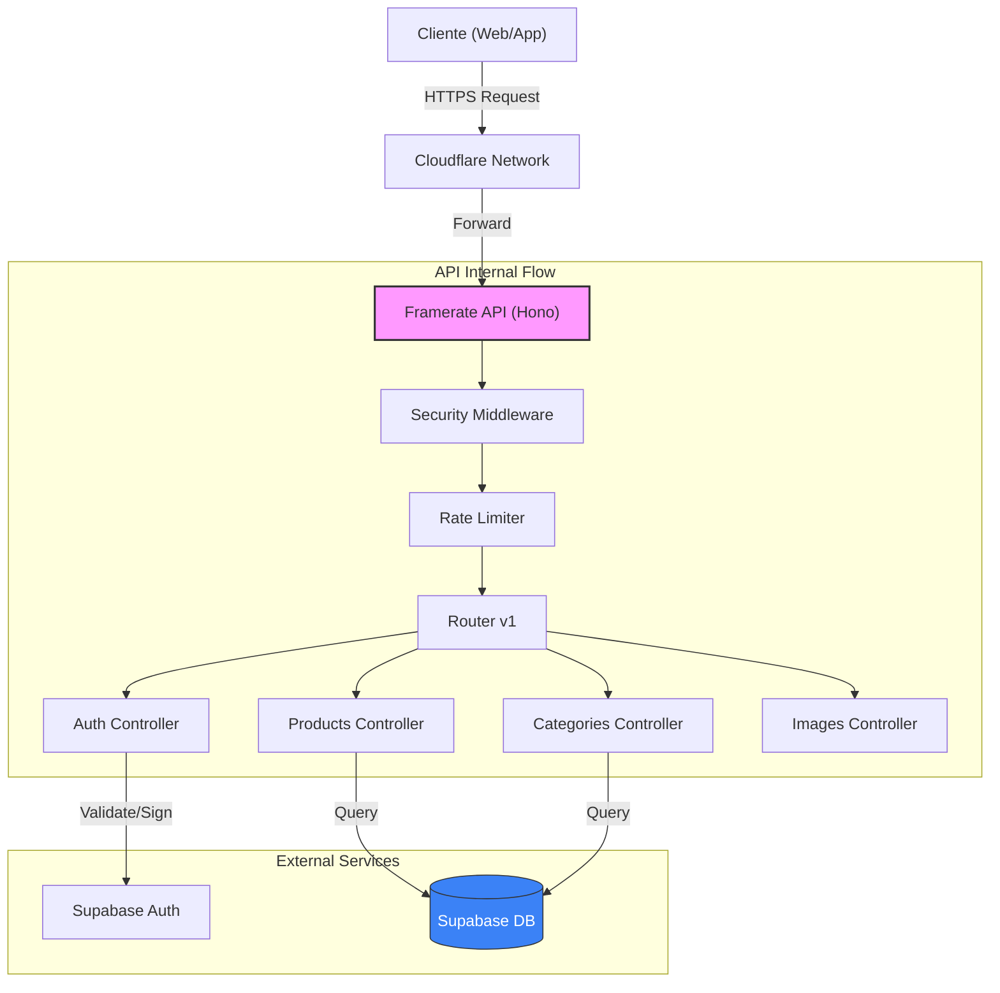

# Framerate API

Esta es la API principal de **Framerate.cl**, encargada de servir los datos de productos, categorías y gestionar la autenticación de usuarios. Está construida sobre **Hono** y diseñada para ejecutarse en el borde (Edge) utilizando **Cloudflare Workers**, lo que garantiza baja latencia y alta disponibilidad.

## Características Principales

- **Framework**: [Hono](https://hono.dev/) (ligero, rápido y compatible con Edge).
- **Runtime**: Cloudflare Workers (Producción) / Bun (Desarrollo).
- **Base de Datos**: Supabase (PostgreSQL).
- **Seguridad**:
  - Headers de seguridad (`secure-headers`).
  - CORS configurado para dominios permitidos.
  - Rate Limiting para prevenir abusos.
- **Arquitectura**: API RESTful versionada (`/v1`).

## Arquitectura

El siguiente diagrama ilustra cómo fluyen las peticiones a través de la API y cómo interactúa con los servicios externos:



## Desarrollo

### Requisitos Previos

- [Bun](https://bun.sh/) instalado.
- Variables de entorno configuradas (ver `.env.example`).

### Variables de Entorno

| Variable | Descripción | Valor por Defecto |
|----------|-------------|-------------------|
| `SUPABASE_URL` | URL del proyecto Supabase | - |
| `SUPABASE_PUBLISHABLE_KEY` | Clave pública de Supabase | - |
| `RATE_LIMIT_WINDOW_MS` | Ventana de tiempo para rate limiting (ms) | `900000` (15 min) |
| `RATE_LIMIT_MAX_REQUESTS` | Máximo de requests por ventana por IP | `100` |

### Instalación

Instala las dependencias del proyecto:

```sh
bun install
```

### Ejecución Local

Para iniciar el servidor de desarrollo. El sistema buscará automáticamente un puerto disponible, intentando primero el puerto **3000**.

```sh
bun run dev
```

La API estará disponible en `http://localhost:3000` (o el puerto asignado).

### Estructura de Endpoints

Todas las rutas están versionadas bajo `/v1`.

| Ruta | Descripción |
|------|-------------|
| `/v1/products` | Búsqueda y detalles de productos de hardware. |
| `/v1/categories` | Listado y jerarquía de categorías. |
| `/v1/auth` | Endpoints para login, registro y gestión de sesión. |
| `/v1/images` | Gestión y servicio de imágenes optimizadas. |
