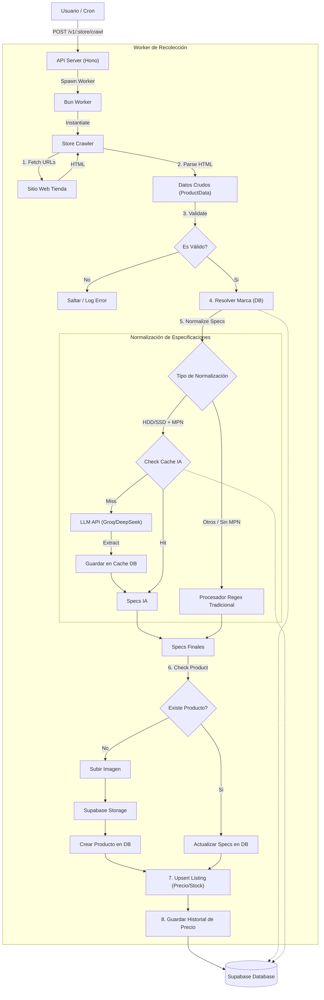

# Framerate Collector Service

Servicio encargado de extraer, normalizar y almacenar información de productos de hardware desde diversas tiendas chilenas. Este servicio es el núcleo de la ingesta de datos para Framerate.cl.

## Arquitectura y Flujo de Datos

El siguiente diagrama describe el flujo completo del proceso de recolección (collector), desde la solicitud inicial hasta el almacenamiento en la base de datos.



## Ejecución en Producción (Coolify)

Este servicio está diseñado para ejecutarse como tareas programadas (Scheduled Tasks) en Coolify o mediante CRON jobs.

### Endpoints de Ejecución

El servicio expone endpoints HTTP para iniciar los procesos de recolección.

#### PC Express
Ejecutar recolección de todas las categorías (Recomendado: 03:00 AM):
```bash
curl -X POST http://localhost:3001/v1/pc-express/crawl
```

#### SP Digital
Ejecutar recolección de todas las categorías (Recomendado: 04:00 AM):
```bash
curl -X POST http://localhost:3001/v1/sp-digital/crawl
```

También es posible ejecutar una categoría específica pasando el parámetro `category`:
```bash
curl -X POST "http://localhost:3001/v1/pc-express/crawl?category=gpu"
```

## Tiendas Soportadas

Actualmente el scraper soporta las siguientes tiendas chilenas de hardware:

- **PC Express** (`pc-express`)
- **SP Digital** (`sp-digital`)
- **BIP** (`bip`)

## Categorías Soportadas

El sistema cuenta con procesadores especializados (Regex + IA) para normalizar las especificaciones de los siguientes componentes:

| Categoría | Slug | Procesamiento |
|-----------|------|---------------|
| Procesadores | `cpu` | Socket, Frecuencia, Núcleos, Caché |
| Tarjetas de Video | `gpu` | Chipset, VRAM, Modelo |
| Placas Madre | `motherboard` | Socket, Chipset, Formato, Tipo RAM |
| Memorias RAM | `ram` | Capacidad, Frecuencia, Latencia, Tipo |
| Almacenamiento SSD | `ssd` | Capacidad, Formato, Interfaz |
| Almacenamiento HDD | `hdd` | Capacidad, RPM, Cache |
| Fuentes de Poder | `psu` | Potencia, Certificación, Modularidad |
| Gabinetes | `case` | Formato, Color, Panel Lateral |
| Coolers CPU | `cpu_cooler` | Tipo (Aire/AIO), Tamaño Radiador |
| Ventiladores | `case_fan` | Tamaño, RGB, Pack |

## Stack Tecnológico

- **Runtime**: [Bun](https://bun.sh) (v1.1+)
- **Framework Web**: [Hono](https://hono.dev)
- **Scraping**: [Puppeteer](https://pptr.dev) (Headless Chrome)
- **Base de Datos**: [Supabase](https://supabase.com) (PostgreSQL)
- **IA / LLM**: OpenAI SDK (Compatible con Groq/DeepSeek) para extracción de specs complejas.
- **Procesamiento de Imágenes**: [Sharp](https://sharp.pixelplumbing.com)

## Estructura del Proyecto

```
src/
├── crawlers/       # Lógica de navegación por tienda (BaseCrawler)
├── processors/     # Lógica de extracción de specs por categoría
│   ├── ai/         # Extractores basados en LLM
│   └── normalizers/# Normalizadores Regex y limpieza de texto
├── workers/        # Bun Workers para ejecución paralela
├── lib/            # Utilidades (Supabase, Logger, Storage)
├── routes/         # Endpoints de la API
└── cron/           # Tareas programadas (si aplica)
```

## Ejecución

### Instalación
```sh
bun install
```

### Desarrollo
Inicia el servidor en modo watch:
```sh
bun run dev
```
El servidor iniciará en `http://localhost:3000`.

### Endpoints Principales

- `POST /v1/pc-express/crawl` - Inicia scraping de PC Express
- `POST /v1/sp-digital/crawl` - Inicia scraping de SP Digital

### Scripts de Utilidad

Existen scripts adicionales en el paquete `@framerate/db` para mantenimiento de datos generados por este scraper, como la agrupación de variantes (`group-variants`).

## Deploy en Coolify

Para desplegar el servicio en Coolify, se deben configurar los siguientes elementos:

### Healthcheck
Definir un healthcheck para verificar la salud del servicio:

- **Método**: `GET`
- **Esquema**: `http`
- **Host**: `localhost`
- **Puerto**: `3001`
- **Path**: `/health`
- **Código de retorno esperado**: `200`
- **Texto de respuesta esperado**: `OK`
- **Intervalo (s)**: `30`
- **Timeout (s)**: `10`
- **Retries**: `3`
- **Start Period (s)**: `30`

### Tareas Programadas
Agregar una tarea programada para cada endpoint de scraping:

1. **Scrape PC Express**:
   - **Frecuencia**: `0 3 * * *` (Ejecutar diariamente a las 3:00 AM).
   - **Endpoint**: `POST /v1/pc-express/crawl`

2. **Scrape SP Digital**:
   - **Frecuencia**: `0 4 * * *` (Ejecutar diariamente a las 4:00 AM).
   - **Endpoint**: `POST /v1/sp-digital/crawl`.

## Tests

El proyecto incluye tests unitarios para validar la normalización de datos:

```sh
bun test
```
