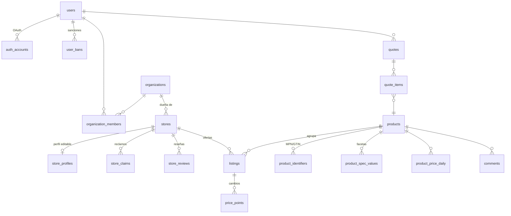

# Modelo de datos (v2)

Diseñado a partir de las funcionalidades que hoy tiene `apps/web` (rutas en
`apps/web/app/routes.ts`). Cada tabla pertenece a **una** feature del servidor,
que es la única que la escribe.

- Migraciones (autoridad del esquema): `packages/database/migrations/0001…0008`.
- Tipos para Kysely: `packages/database/src/database.ts`.
- Specs técnicas por categoría: `packages/contracts/src/specs.ts`.
- Invariantes verificadas contra D1 real: `packages/database/test/schema.integration.test.ts`.

## Convenciones

| Tema | Regla |
|---|---|
| Fechas | `TEXT` ISO-8601 UTC, las escribe la API (los triggers usan el mismo formato). |
| Booleanos | `INTEGER` 0/1 con `CHECK`. |
| JSON | `TEXT` con `CHECK (json_valid(...))`; estructura validada con Zod en la API. |
| Ids | `INTEGER` autoincremental internamente; `public_id` corto y no adivinable cuando el id aparece en una URL (cotizaciones, tickets). Usuarios: `TEXT` (lo genera Better Auth). |
| Borrado | Contenido de usuarios con **borrado lógico** (`deleted_at` + `deletion_reason`). Auditorías **append-only**. |
| Contadores | Derivados (promedio de tienda, likes, respuestas, votos útiles) se mantienen con **triggers**: una sola fuente, sin dos cálculos que discrepen. |
| Autorización | D1 no tiene RLS: la autoriza la API. La base garantiza **integridad** (unicidad, rangos, estados válidos) aunque la API tenga un bug. |
| Archivos | Claves de R2 (`*_key`), nunca URLs arbitrarias enviadas por el cliente. |

## Mapa por feature

| Feature | Tablas | Web que la usa |
|---|---|---|
| **identity** | `users`, `auth_accounts`, `auth_sessions`, `auth_verifications`, `user_bans` | login, `/profile`, `/u/:username`, `/settings/*`, `/admin/users` |
| **organizations** | `organizations`, `organization_members`, `organization_invitations` | `/tiendas/:slug/admin` (miembros), menú "mis tiendas" |
| **catalog** (lectura) + **ingestion** + **matching** (escritura) | `stores`, `products`, `product_identifiers`, `product_spec_values`, `product_variant_groups`, `product_slug_redirects`, `listings`, `price_points`, `product_price_daily`, `match_decisions`, `match_reviews`, `crawl_runs`, `quarantine` | home, `/explorar`, `/categoria/:slug`, `/producto/:slug`, búsqueda, `/admin/gatekeeper` |
| **stores** | `store_profiles`, `store_claims`, `store_claim_events`, `store_reviews`, `store_review_votes` | `/tiendas/:slug`, `/tiendas/:slug/admin`, `/reclamar`, `/tiendas/:slug/resenas` |
| **quotes** | `quotes`, `quote_items` | `/cotizacion/:id`, agregar a cotización, perfil |
| **comments** | `comments`, `comment_likes` | sección de comentarios del producto |
| **moderation** | `reports`, `moderation_actions`, `translation_feedback` | `/admin/moderation`, botón reportar, feedback de traducciones |
| **support** | `support_tickets`, `support_messages` | `/settings/tickets`, `/admin/support`, formulario de contacto |
| **analytics** | `product_views_daily`, `outbound_clicks` | tendencias/popularidad, analítica para tiendas reclamadas |

---

## identity

- **`users`** es cuenta y perfil a la vez (antes: `auth.users` + `profiles`
  con lógica de creación duplicada en un trigger y en la API).
  - `username`: 3–24 caracteres `[a-z0-9_]`, único. **Se genera en el servidor**
    al registrarse. Antes se copiaba del proveedor OAuth sin validar formato, y
    en caso de colisión el perfil no se creaba.
  - `display_name` es obligatorio: se acaba la cadena de fallbacks
    `full_name → username → metadata` repetida en la web.
  - `avatar_key`: el avatar se copia a R2. Antes la API aceptaba cualquier
    `avatar_url` del cliente.
  - `role` es **una sola columna** (`user` < `moderator` < `admin`). Antes
    había varias filas en `user_roles`, tres definiciones incompatibles y
    funciones SQL que fallaban con más de una fila.
  - `lang` y `theme` se guardan en el perfil. El tema antes vivía sólo en
    cookie y no coincidía con el script anti-parpadeo.
  - `deleted_at` permite eliminar la cuenta anonimizando datos personales sin
    romper la autoría de comentarios y reseñas.
- **`auth_*`**: esquema de Better Auth (OAuth: Discord, Google…) en snake_case.
  Sesiones en D1 y verificación en la API. Antes el JWT se decodificaba sin
  verificar su firma.
- **`user_bans`**: una fila por sanción, con historial. Antes era una fila por
  usuario sobrescrita con upsert. `expires_at NULL` significa permanente. Una
  sanción está activa si `lifted_at IS NULL AND (expires_at IS NULL OR
  expires_at > now)`. **La API la verifica en toda escritura de contenido**;
  antes sólo lo hacían algunas políticas RLS.

## organizations

- Una organización es dueña de N tiendas y sus roles aplican a todas.
- La regla "siempre al menos un `owner`" y "`admin` no puede otorgar `owner`"
  vive en la API.
- **Invitaciones por email con token de un solo uso.** Antes se agregaban
  miembros pegando un UUID.

## catalog, ingestion y matching

Ver [architecture.md](./architecture.md) §4–5 para matching e ingesta. Lo nuevo:

- **`products.specs`**: specs completas validadas por categoría
  (`contracts/specs.ts`). Usan enums en minúsculas y `null` para lo
  desconocido. Antes había strings centinela como "Desconocido" y variantes como
  "80+ Gold" / "80 plus gold". Se agrega `memory.max_speed_mt_s` en placas, que
  la regla de velocidad de RAM necesitaba y no existía.
- **`product_spec_values`**: specs aplanadas, una fila por (clave, valor), con
  índices por clave y valor. Arregla tres fallas de filtros que el sistema
  anterior no podía resolver:
  - claves anidadas (`cores.total`),
  - multi-selección, que sólo tomaba el primer valor,
  - campos array (`sockets`).
- **Resumen de precios en `products`** (`best_price`, `offer_count`,
  `reference_price`, `views_7d`…). Son datos derivados que se recalculan tras
  cada corrida y permiten ordenar por precio, descuento o popularidad sin
  agregar en cada request.
  - Sólo se muestran productos con `offer_count > 0`. Antes aparecían productos
    a "$0" y variantes que llevaban a un 404.
- **`product_price_daily`**: mejor precio por día. Es la base de:
  - el gráfico de mejor precio,
  - el "descuento real" (referencia = máximo de 90 días),
  - las bajas de precio.
  - Antes la referencia dependía de la oferta más barata del momento y se
    reiniciaba cuando cambiaba.
- **`product_variant_groups`**: "Otras versiones".
- **`product_slug_redirects`**: 301 al renombrar o fusionar.
- **`stores`** contiene los datos canónicos que escribe el sistema, más el
  estado del reclamo (`organization_id`, `verified_at`, `frozen_at`) y los
  contadores de reseñas. `domain` es único.
- **Categorías**: viven en código (`contracts/categories.ts`), con los mismos
  slugs que la web ya publica. Antes estaban duplicadas en 4 lugares.

## stores

- **`store_profiles`**: capa editable por la organización, con límites en la
  base. Antes no había validación en el servidor, y un `website` inválido
  rompía el header.
- **`store_claims`**: reclamo por DNS TXT con ciclo
  `pending → verified → confirmed`, además de `expired`, `stale` y `revoked`.
  - **Un solo reclamo vivo por tienda** mediante un índice único. Antes un
    segundo usuario podía "sumarse" como dueño de una tienda ya reclamada.
  - `consecutive_failures` es una columna real. Antes era JSON metido en
    `last_error`.
  - `confirmed` es un estado explícito. Antes el reclamo quedaba en `verified`
    y la web seguía ofreciendo "Continuar".
- **`store_claim_events`**: auditoría append-only.
- **Revocar** un reclamo desvincula la tienda, pero **no** borra los miembros de
  la organización. El sistema anterior vaciaba la organización entera; esta
  regla vive en la API.
- **`store_reviews`**:
  - Una reseña activa por usuario y tienda, garantizada por un índice único
    parcial. Antes sólo la API lo revisaba.
  - Promedio y cantidad en `stores.rating_*`, mantenidos por triggers. Antes
    había dos cálculos distintos que no coincidían.
  - Las reseñas eliminadas no cuentan.
  - `deletion_reason` es un enum (`author` o `moderation`). Antes se mostraba
    públicamente un texto libre.
- **`store_review_votes`**: "útil", uno por usuario, con contador por trigger.
  La API expone "mis votos", que antes no existía y rompía el toggle.

## quotes

- **`public_id`** en la URL. Antes el parámetro se llamaba `slug` pero era el
  UUID.
- **`visibility`**: `private`, `unlisted` (con link) o `public` (aparece en el
  perfil).
- **`quote_items.slot`** y **`is_selected`**: el modelo de slots de la web
  ahora es persistente.
  - En los slots exclusivos se guardan alternativas, pero la base garantiza
    **una sola seleccionada**.
  - Antes la selección vivía en estado local, y el análisis y los totales no
    coincidían con lo que el usuario veía.
- `listing_id NULL` significa "mejor precio disponible". Si no es NULL es la
  tienda elegida, y si esa oferta desaparece se vuelve a NULL.
- Un trigger actualiza `updated_at` e **invalida el análisis** al cambiar
  ítems. Antes `updated_at` no se actualizaba.

## comments

- Comentarios sólo en productos, con FK real. Antes eran polimórficos sin FK.
- Árbol de hasta 10 niveles. `root_id`, `depth` y `path` (ruta materializada)
  **los calcula un trigger**, que también verifica que la respuesta sea del
  mismo producto que su padre.
- `reply_count` en las raíces cuenta sólo respuestas vivas. Antes contaba
  también las eliminadas.
- **Sólo "me gusta"** (`comment_likes`), que es lo que usa la web. Antes había
  votos negativos que la UI nunca enviaba.
- Borrado lógico: el cuerpo pasa a NULL, la estructura del hilo se conserva y
  `deletion_reason` es un enum.
- La regla de editar sólo durante 5 minutos y sólo el autor vive en la API.

## moderation

- **`reports`**:
  - Objetivos: producto, comentario, reseña, tienda, cotización y usuario.
  - Un reporte vivo por objetivo y denunciante (incluye `reviewing`; antes
    sólo `open`).
  - `claimed_by`/`claimed_until` reemplazan la cola `pgmq`.
  - **`resolution`** dice qué se hizo con el contenido. Antes resolver un
    reporte no afectaba al contenido.
- **`moderation_actions`**: **una sola bitácora** de acciones privilegiadas.
  Antes eran dos: `mod_actions` y `comment_moderation_log`.
- **`translation_feedback`**: ahora con estado y revisión. Antes no se podía
  leer desde ninguna parte.
- **Gatekeeper**: lo reemplazan `match_reviews` y `match_decisions`. El
  anterior estaba roto: el botón "Crear nuevo" no creaba nada y las RPC no
  verificaban roles.

## support

- El primer mensaje vive en `support_messages`, igual que el resto. Antes se
  duplicaba en el ticket.
- **Tickets anónimos**: se envía un link de seguimiento con token y se guarda
  sólo su hash. Antes quien escribía sin cuenta nunca recibía respuesta.
- Notas internas: la base garantiza que sólo las escribe staff. La API las
  filtra explícitamente; antes dependía de RLS, y un moderador que abría su
  propio ticket las veía.
- `store_id` es opcional, para asociar el ticket a una tienda.
- Los cambios de estado automáticos (respuesta del staff → `waiting_user`, y
  viceversa) viven en la API.

## analytics

- **`product_views_daily`**: vistas por día. La popularidad (`views_7d`) usa
  una ventana. Antes era un contador histórico que además se duplicaba.
- **`outbound_clicks`**: clics hacia tiendas, con `store_id` obligatorio. Antes
  la página de producto no lo enviaba. Es la base de la analítica para tiendas
  reclamadas.

## Fuera de alcance por ahora

- Alertas de precio: existía la tabla, pero la web no la usaba. Se agregan
  cuando se construya la funcionalidad.
- Reseñas de productos y compra verificada.
