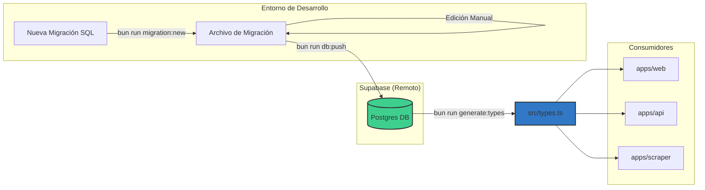

# @framerate/db

**Esquema de Base de Datos, Migraciones y Definiciones de Tipos**

Este paquete actúa como la autoridad central para el esquema de base de datos del proyecto Framerate.cl. Gestiona las migraciones de Supabase, administra las conexiones y exporta los tipos TypeScript generados automáticamente para garantizar la seguridad de tipos en todo el monorepo (`web`, `api`, `scraper`).

## 1. Visión General

### 1.1 Propósito
*   **Única Fuente de Verdad:** Define el esquema canónico de la base de datos mediante migraciones de Supabase.
*   **Seguridad de Tipos:** Genera y exporta definiciones TypeScript (`src/types.ts`) derivadas directamente del esquema de la base de datos.
*   **Gestión de Migraciones:** Proporciona herramientas para crear y aplicar migraciones SQL.
*   **Utilidades de Almacenamiento:** Incluye funciones auxiliares para interactuar con los buckets de Supabase Storage.

### 1.2 Arquitectura
El proyecto sigue un flujo de trabajo "Remote-First" para el desarrollo de la base de datos. En lugar de mantener instancias locales de PostgreSQL, el desarrollo se realiza contra un proyecto remoto de Supabase (staging o producción) para asegurar la consistencia y simplificar la configuración del entorno.



## 2. Configuración

### 2.1 Variables de Entorno
Para ejecutar los scripts de gestión, se requieren variables de entorno específicas.

1.  Copiar la configuración de ejemplo:
    ```bash
    cp .env.example .env
    ```

2.  Configurar las siguientes variables:

| Variable | Descripción |
| :--- | :--- |
| `SUPABASE_PROJECT_REF` | El ID de referencia del proyecto en Supabase. Requerido para la generación de tipos. |

**Nota:** La CLI de Supabase debe estar autenticada en la máquina local (`supabase login`).

## 3. Flujo de Trabajo

### 3.1 Creación de Migraciones
Para introducir cambios en el esquema (tablas, columnas, funciones), se debe crear un nuevo archivo de migración:

```bash
bun run migration:new <nombre_migracion>
```
Esto genera un archivo SQL con marca de tiempo en `supabase/migrations/`.

### 3.2 Aplicación de Cambios
Para subir las migraciones locales a la base de datos remota:

```bash
bun run db:push
```
Este comando aplica cualquier migración pendiente que no se haya ejecutado aún en la base de datos remota.

### 3.3 Generación de Tipos
Después de aplicar cambios en el esquema, es necesario regenerar las definiciones de TypeScript:

```bash
bun run generate:types
```
Esto actualiza `src/types.ts` para reflejar el estado actual de la base de datos, asegurando que el código de la aplicación permanezca sincronizado con el esquema.

## 4. Scripts Disponibles

| Script | Comando | Descripción |
| :--- | :--- | :--- |
| `generate:types` | `bun src/scripts/generate-types.ts` | Obtiene el esquema actual y genera interfaces TypeScript. |
| `migration:new` | `supabase migration new` | Crea un nuevo archivo de migración SQL vacío. |
| `db:push` | `supabase db push` | Aplica las migraciones locales a la base de datos remota. |
| `db:reset` | `supabase db reset` | Resetea la base de datos (operación destructiva). |
| `db:link` | `bun src/scripts/db-link.ts` | Vincula el proyecto local con el proyecto remoto de Supabase. |

## 5. Estructura del Paquete

```
packages/db/
├── src/
│   ├── scripts/       # Scripts de utilidad (generación de tipos, vinculación)
│   ├── index.ts       # Punto de entrada, exporta tipos y utilidades
│   ├── types.ts       # Definiciones de tipos de base de datos autogeneradas
│   └── storage.ts     # Utilidades de Supabase Storage
├── supabase/
│   ├── migrations/    # Archivos de migración SQL
│   └── config.toml    # Configuración de Supabase CLI
└── package.json
```

## 6. Gestión de Almacenamiento (Storage)

El paquete exporta utilidades para gestionar archivos en Supabase Storage.

### 6.1 Buckets

#### `store-logos`
*   **Propósito:** Almacenar logotipos de tiendas.
*   **Convención de Nombres:** `{store_slug}.{ext}` (ej. `sp-digital.png`).
*   **Límite de Tamaño:** 1MB.
*   **Tipos Permitidos:** PNG, JPEG, WebP, SVG.

#### `product-images`
*   **Propósito:** Almacenar imágenes de productos identificadas por MPN.
*   **Convención de Nombres:** `{mpn}.{ext}` (ej. `RTX4090-GAMING-X-TRIO.webp`).
*   **Límite de Tamaño:** 2MB.
*   **Tipos Permitidos:** PNG, JPEG, WebP.

### 6.2 Ejemplo de Uso

```typescript
import { 
  StorageBuckets,
  getStoreLogoPath,
  getProductImagePath,
  getStoreLogoUrl,
  getProductImageUrl,
  isAllowedMimeType,
  isWithinSizeLimit,
} from "@framerate/db";

// Obtener ruta de archivo para logo de tienda
const logoPath = getStoreLogoPath("sp-digital");

// Obtener ruta de archivo para imagen de producto (usando MPN)
const imagePath = getProductImagePath("RTX4090-GAMING-X-TRIO");

// Obtener URL pública para logo de tienda
const logoUrl = getStoreLogoUrl(
  "https://project-ref.supabase.co",
  "sp-digital"
);

// Validar tipo MIME
const isValidType = isAllowedMimeType(StorageBuckets.STORE_LOGOS, "image/png");

// Validar tamaño de archivo
const isValidSize = isWithinSizeLimit(StorageBuckets.STORE_LOGOS, 500000);
```

### 6.3 Estrategia MPN
El Número de Parte del Fabricante (MPN) se utiliza como identificador único para las imágenes de productos para asegurar:
1.  **Deduplicación:** Productos idénticos en diferentes tiendas comparten el mismo recurso de imagen.
2.  **Consistencia:** Representación visual uniforme para los listados de productos.
3.  **Eficiencia:** Minimiza el uso de almacenamiento evitando subidas duplicadas.
